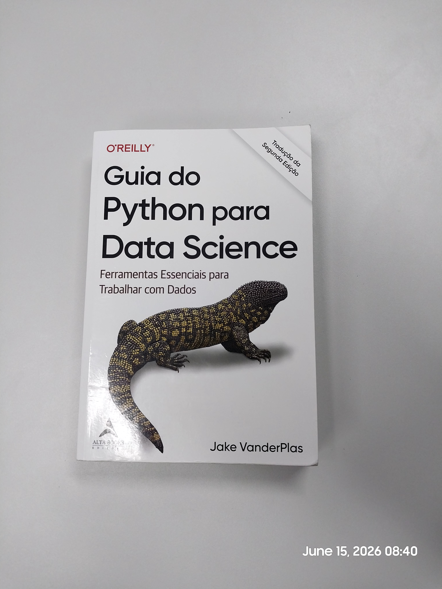
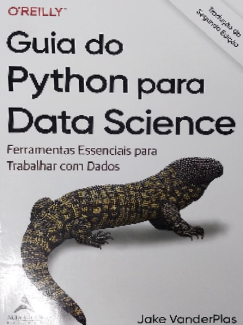

# 📄 Document Scanner

Projeto simples de scanner de documentos usando **Python** e **OpenCV**, desenvolvido com o objetivo de aprender visão computacional na prática — detecção de contornos, transformação de perspectiva e thresholding adaptativo.

## Como funciona

O programa captura uma imagem (webcam ou arquivo), detecta o maior contorno quadrilateral presente na cena (a folha de papel), corrige a perspectiva e aplica um threshold adaptativo, simulando o resultado de um scanner físico.

**Pipeline de processamento:**

```
Imagem original → Escala de cinza → Blur → Canny Edge Detection
→ Dilatação/Erosão → Detecção de contorno → Warp de perspectiva → Threshold adaptativo
```

## Resultado

<table>
  <tr>
    <th align="center">Original</th>
    <th align="center">Scanned</th>
  </tr>
  <tr>
    <td align="center"></td>
    <td align="center"></td>
  </tr>
</table>

## Como rodar

Pré-requisito: ter o [uv](https://docs.astral.sh/uv/) instalado.

```bash
# Clone o repositório
git clone https://github.com/seu-usuario/document-scanner.git
cd document-scanner

# Instala as dependências
uv sync

# Rode o projeto
uv run Main.py
```

> Por padrão o projeto roda com a imagem `photo.jpg`. Para usar a webcam, altere `webCamFeed = False` para `True` no início do `Main.py`.

Pressione **`s`** para salvar o documento escaneado na pasta `Scanned/`.

## Dependências

| Pacote | Versão mínima |
|---|---|
| Python | 3.12 |
| opencv-python | 4.13.0.92 |
| numpy | 2.4.6 |
